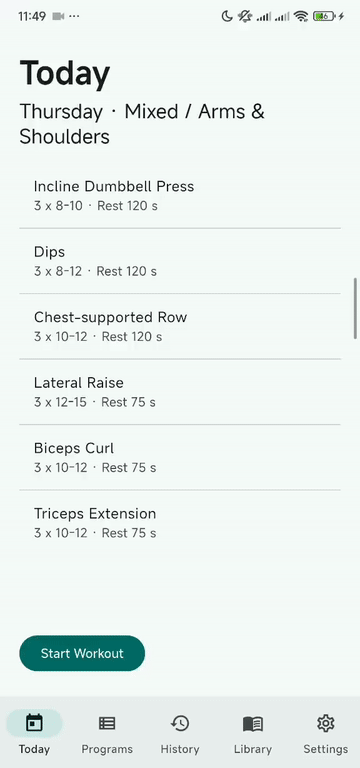

# Gym Runner

An offline-first Flutter workout tracker — build programs, run them set by set with a rest timer, and keep your whole training history on-device.

## Demo

<p align="center">
  
</p>

Full walkthrough — programs, history, plate calculator and backup/export:

https://github.com/user-attachments/assets/14a91278-05f7-4d68-9165-3e3f61699948

## Features

- **Today / Runner** — work through a session one exercise at a time, log sets, warm-ups and RPE, with a built-in rest timer and Gym Mode for a distraction-free screen
- **Programs** — build multi-day programs, set prescriptions per exercise, reuse them week to week
- **Exercise library** — animated form GIFs for each movement, searchable and linkable to your own exercises
- **History** — per-session and per-exercise history with estimated 1RM tracking and live PR detection
- **Plate calculator** — what to load on the bar for any target weight
- **Backup & restore** — export and reimport your data from Settings
- **Light / dark / system themes**

## Getting started

```bash
flutter pub get
flutter run
```

Requires Flutter with Dart SDK ^3.10.7.

For building a signed Android release, see [RELEASE_ANDROID.md](RELEASE_ANDROID.md).
